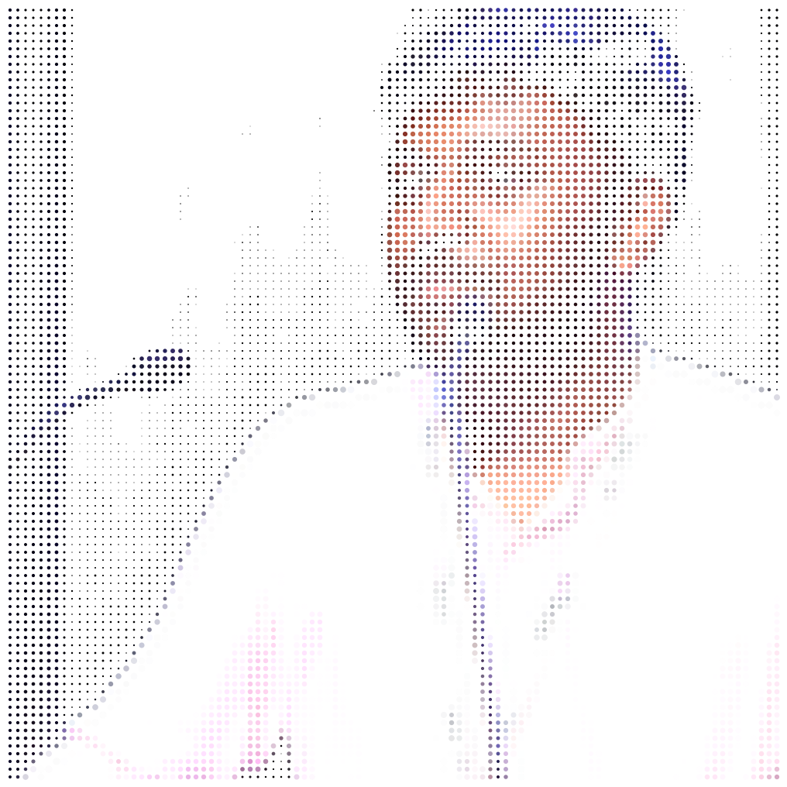
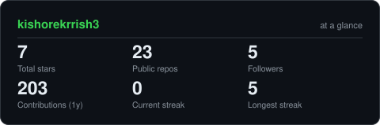
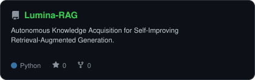
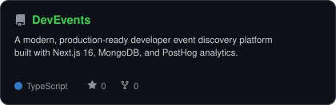
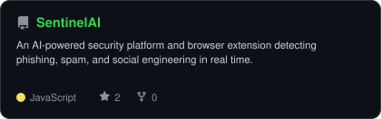
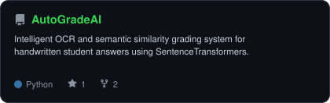

<div align="center">

<!-- PORTRAIT - generated by scripts/dotify.py from assets/avatar.png.
     Colour mode, so one file serves both GitHub themes. Regenerate with:
       python scripts/dotify.py assets/avatar.png -o assets/portrait \
         --cols 100 --equalize --detail 0.5 --color -->


<br>

<!-- NAME / TAGLINE - animated typing -->
<a href="https://github.com/kishorekrrish3">
  
</a>

<br>

<!-- SOCIALS -->
<a href="https://linkedin.com/in/kishore-p"></a>
<a href="mailto:kidkrrish3@gmail.com"></a>
<a href="https://kishore-p-portfolio.vercel.app"></a>
<a href="https://leetcode.com/u/kishore_krr333"></a>
<a href="https://hackerrank.com/kidkrrish3"></a>
<a href="https://behance.net/kidkrrish"></a>


</div>

---

## `~/` whoami

```console
$ cat about.txt
```

Hi, I'm **Kishore P**. Final-Year CSE (AI & Robotics) student at VIT Chennai, building intelligent systems at the intersection of Generative AI, Retrieval-Augmented Generation (RAG), and modern full-stack web applications.

- Currently building **[Lumina RAG](https://github.com/kishorekrrish3/Lumina-RAG)** — autonomous knowledge acquisition for self-improving RAG
- Portfolio: **[kishore-p-portfolio.vercel.app](https://kishore-p-portfolio.vercel.app)**
- Exploring **Agentic AI workflows, Deep Learning, Cloud Architectures (AWS), and Next.js 16**
- Fun fact: **I design UI/UX in Figma before writing a single line of neural network or frontend code.**

<br>

<div align="center">

## `~/` toolbox


</div>

---

<div align="center">

## `~/` skill radar

<table>
<tr>
<td width="50%" align="center" valign="middle">

<!-- Self-rated radar - edit assets/skills.json, the workflow redraws it -->
<picture>
  <source media="(prefers-color-scheme: dark)"  srcset="assets/radar-dark.svg">
  <source media="(prefers-color-scheme: light)" srcset="assets/radar-light.svg">
  
</picture>

</td>
<td width="50%" align="center" valign="middle">

<!-- Live radar built from real language byte counts across your repos -->
<picture>
  <source media="(prefers-color-scheme: dark)"  srcset="assets/radar-langs-dark.svg">
  <source media="(prefers-color-scheme: light)" srcset="assets/radar-langs-light.svg">
  
</picture>

</td>
</tr>
</table>

</div>

---

<div align="center">

## `~/` contribution calendar

<!-- 3D isometric calendar, regenerated every 6h by .github/workflows/metrics.yml -->


<br><br>

<!-- Snake eats the contribution graph - .github/workflows/snake.yml -->
<picture>
  <source media="(prefers-color-scheme: dark)"  srcset="https://raw.githubusercontent.com/kishorekrrish3/kishorekrrish3/output/snake-dark.svg">
  <source media="(prefers-color-scheme: light)" srcset="https://raw.githubusercontent.com/kishorekrrish3/kishorekrrish3/output/snake.svg">
  
</picture>

</div>

---

<div align="center">

## `~/` the numbers

<!-- Generated by scripts/cards.py into this repo. Deliberately NOT
     github-readme-stats / streak-stats / github-profile-trophy: those are
     shared public instances that go down and take the whole section with them. -->
<picture>
  <source media="(prefers-color-scheme: dark)"  srcset="assets/card-stats-dark.svg">
  <source media="(prefers-color-scheme: light)" srcset="assets/card-stats-light.svg">
  
</picture>

<br>


<br><br>


</div>

---

<div align="center">

## `~/` selected work

<!-- Cards generated by scripts/cards.py from assets/projects.json.
     Stars, forks and language are pulled live from the API on every run. -->
<table>
<tr>
<td width="50%">
  <a href="https://github.com/kishorekrrish3/Lumina-RAG">
    <picture>
      <source media="(prefers-color-scheme: dark)"  srcset="assets/card-Lumina-RAG-dark.svg">
      <source media="(prefers-color-scheme: light)" srcset="assets/card-Lumina-RAG-light.svg">
      
    </picture>
  </a>
</td>
<td width="50%">
  <a href="https://github.com/kishorekrrish3/DevEvents">
    <picture>
      <source media="(prefers-color-scheme: dark)"  srcset="assets/card-DevEvents-dark.svg">
      <source media="(prefers-color-scheme: light)" srcset="assets/card-DevEvents-light.svg">
      
    </picture>
  </a>
</td>
</tr>
<tr>
<td width="50%">
  <a href="https://github.com/kishorekrrish3/SentinelAI">
    <picture>
      <source media="(prefers-color-scheme: dark)"  srcset="assets/card-SentinelAI-dark.svg">
      <source media="(prefers-color-scheme: light)" srcset="assets/card-SentinelAI-light.svg">
      
    </picture>
  </a>
</td>
<td width="50%">
  <a href="https://github.com/kishorekrrish3/AutoGradeAI">
    <picture>
      <source media="(prefers-color-scheme: dark)"  srcset="assets/card-AutoGradeAI-dark.svg">
      <source media="(prefers-color-scheme: light)" srcset="assets/card-AutoGradeAI-light.svg">
      
    </picture>
  </a>
</td>
</tr>
</table>

<sub>

| project | description | stack |
|---|---|---|
| **[Lumina-RAG](https://github.com/kishorekrrish3/Lumina-RAG)** | Autonomous Knowledge Acquisition for Self-Improving RAG | `Python` `LangChain` `FAISS` |
| **[DevEvents](https://github.com/kishorekrrish3/DevEvents)** | Event discovery platform with PostHog & MongoDB | `Next.js 16` `TypeScript` `Tailwind` |
| **[SentinelAI](https://github.com/kishorekrrish3/SentinelAI)** | AI-powered security detecting phishing & social engineering | `JavaScript` `Chrome Extension` `ML` |
| **[AutoGradeAI](https://github.com/kishorekrrish3/AutoGradeAI)** | OCR & semantic similarity grading for handwritten answers | `Python` `Streamlit` `EasyOCR` |

</sub>

</div>

---

<div align="center">

<sub>`01110100 01101000 01100001 01101110 01101011 01110011 00100000 01100110 01101111 01110010 00100000 01110011 01100011 01110010 01101111 01101100 01101100 01101001 01101110 01100111`</sub>

</div>
